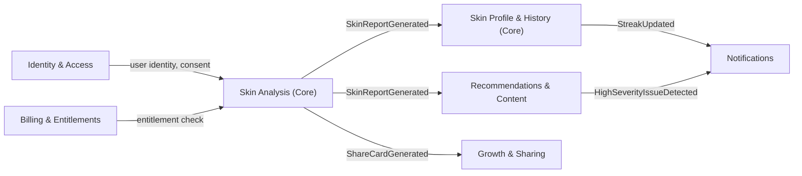
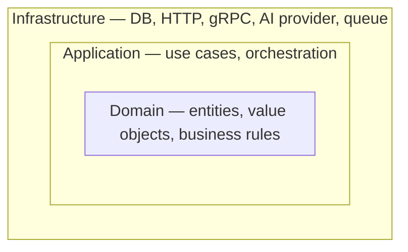

# Domain-Driven Design & Onion Architecture
Part of: [[00-Phase-0-Roadmap-MOC|Phase 0 Roadmap]]

## Bounded Contexts
Each row below is a place where a shared word (e.g., "Profile") can mean something specific to that context without conflicting with its meaning elsewhere.

| Bounded Context | Subdomain Type | Owns | Why it's separate |
|---|---|---|---|
| **Skin Analysis** | Core | Scan, AnalysisJob, SkinReport, Issue | This *is* the product. Gets the most engineering investment and the most architectural care. |
| **Skin Profile & History** | Core | SkinProfile, Trend, SkinAge, Streak | Different lifecycle than Analysis (aggregating over time vs. processing one event) and a different query shape (time-series reads vs. write-once). |
| **Recommendations & Content** | Supporting | Tip, Routine, Referral rule set | Logic here will get more sophisticated (personalization, ML) later, but doesn't need to live inside Analysis. |
| **Growth & Sharing** | Supporting | ShareCard, referral attribution, badges | Product-growth logic, not skin-domain logic — keep it swappable/replaceable. |
| **Identity & Access (IAM)** | Generic | User, Credential, Session, ConsentRecord | Solved problem industry-wide; candidate to eventually lean on a managed provider (Auth0/Firebase Auth) rather than fully hand-rolling. |
| **Notifications** | Generic | Reminder scheduling, push/email dispatch | Same — candidate for "buy," not "build" (FCM, SendGrid). |
| **Billing & Entitlements** | Supporting | Subscription, Entitlement, ReceiptValidation | Consumes **store** billing (StoreKit 2 / Google Play Billing) rather than owning payment logic — see [[07-Product-Decisions\|PD-3]]. |
| **Partner API** *(future, not Phase 0)* | Core (eventually) | Partner, ApiKey, UsageMetering | Don't build this yet — but Skin Analysis should be shaped so this can consume it later without a rewrite (see ADR-001). |

### Context relationships (at a glance)

Skin Analysis is the upstream **publisher** for most of the interesting events; everything else is a downstream **subscriber** reacting to facts it doesn't own. That asymmetry is intentional — it's what makes ADR-001's "monolith now, EDA later" path realistic instead of wishful.

## Aggregates & Invariants
An aggregate is a consistency boundary — the smallest thing that must be transactionally correct *right now*. Everything outside its boundary is allowed to be eventually consistent.

| Aggregate Root | Context | Key Invariants |
|---|---|---|
| **Scan** | Skin Analysis | Exactly one photo per Scan · state machine `Submitted → Processing → Completed \| Rejected \| Failed` · cannot be resubmitted once `Completed` · `SkinReport` is created as part of completing the Scan (same transaction) |
| **SkinProfile** | Skin Profile | Exactly one profile per User · trend history is append-only · a given calendar day contributes at most one entry to the streak, regardless of scan count |
| **User** | IAM | Unique email/phone · no `Scan` command is accepted unless `ConsentGranted` exists for that user (enforced via a policy check, not a shared DB transaction across contexts) |
| **Subscription** | Billing | At most one *active* subscription per user · entitlement state is always derivable from subscription state, never stored redundantly · state is derived from **store-validated receipts**, never from local charge logic ([[07-Product-Decisions\|PD-3]]) |
| **User** *(amended)* | IAM | Registration refused if derived age < 18 ([[07-Product-Decisions\|PD-1]]) · stores `birthYear` (not full DOB) and `timezone` |
| **SkinProfile** *(amended)* | Skin Profile | At most one streak entry per ISO week **in the user's timezone**, regardless of scan count · only `Completed` scans qualify ([[07-Product-Decisions\|PD-5]]) |

> [!tip] Why is SkinReport inside the Scan aggregate, not its own?
> A Scan and its Report are created together and never make sense independently — strong consistency is cheap and correct here. SkinProfile, by contrast, is updated *because of* a Scan but doesn't need to be consistent with it in the same transaction — a short delay between "report ready" and "trend graph updated" is invisible to the user and buys a much simpler, more scalable design (event-driven update instead of a distributed transaction).

## Onion (Clean) Architecture
Dependencies point **inward only**. Nothing in the Domain layer imports a database driver, an HTTP framework, or a third-party AI SDK — full stop.



- **Domain layer**: `Scan`, `SkinReport`, `Severity`, `SkinProfile` as plain Go structs with methods enforcing invariants (e.g., `scan.Complete(report SkinReport) error` refuses to run twice). No imports outside the standard library.
- **Application layer**: use cases like `SubmitScanUseCase`, `GenerateReportUseCase` — orchestrate domain objects, call out to **ports** (interfaces), never to concrete infrastructure.
- **Ports** are interfaces *defined by* the application/domain layer, describing what it needs — not what infrastructure happens to offer. This is the actual Dependency Inversion: the arrow of "who defines the contract" points inward even though the arrow of "who calls whom at runtime" points outward.
- **Infrastructure layer**: Postgres repository implementations, the AI-provider HTTP client, the object-storage adapter, the queue publisher/consumer, and the REST/gRPC transport handlers. All of it *implements* ports; none of it is imported by Domain or Application.

Minimal illustration of the inversion, Go-flavored:

```go
// domain/analysis/port.go — defined INSIDE the domain-facing package
type ScanRepository interface {
    Save(ctx context.Context, s Scan) error
    FindByID(ctx context.Context, id ScanID) (Scan, error)
}

type AIAnalysisProvider interface {
    Analyze(ctx context.Context, photo PhotoRef) (SkinReport, error)
}

// infrastructure/postgres/scan_repository.go — implements the port, depends INWARD on domain
type PostgresScanRepository struct{ db *sql.DB }

func (r *PostgresScanRepository) Save(ctx context.Context, s analysis.Scan) error {
    // sql.DB details live here, not in domain
    ...
}
```

The `application` layer's `SubmitScanUseCase` only ever sees `ScanRepository` and `AIAnalysisProvider` — swapping Postgres for something else, or swapping the AI vendor, never touches domain or application code.

## Related
[[02-Domain-Discovery-and-Event-Storming|← Domain Discovery & Event Storming]] · [[04-HLD-and-Architectural-Decisions|Next: HLD & Architectural Decisions →]]
