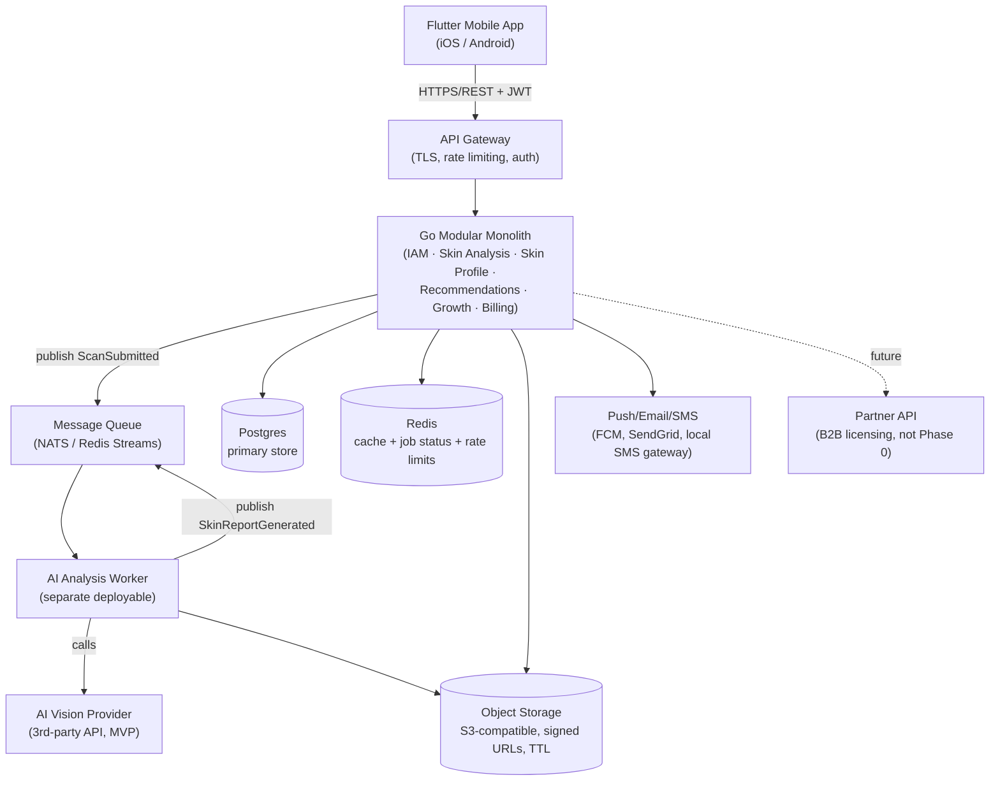

# High-Level Design & Architectural Decisions
Part of: [[00-Phase-0-Roadmap-MOC|Phase 0 Roadmap]]

## System Context Diagram

Two things worth noticing:
1. **The AI worker is its own deployable from day one**, even though everything else is one monolith. It has a fundamentally different scaling profile (bursty, CPU/GPU-bound, cost-per-call) than the rest of the API — see ADR-002.
2. **Third-party AI provider, not an in-house model, for the MVP.** Validating the product and business with a vendor API is faster and cheaper than training/hosting a custom vision model before you know the product works. Owning the model becomes worth revisiting once volume and unit economics justify it, or once B2B customers require it.

> [!warning] "AI Vision Provider" is still a placeholder
> No vendor is selected, and everything downstream — the `SkinReport` shape, the event payload in [[05-Project-Structure-and-Contracts|Contracts]], the FR-4 report screen, and NFR-7's unit economics — assumes a response shape nobody has verified. [[06-AI-Provider-Evaluation|Section 6]] is the spike that settles it, and ADR-003 records the outcome. Treat this box as unresolved until then.

## ADR-001: Start with a Modular Monolith, Migrate to Event-Driven Architecture as Complexity Grows

**Status:** Accepted

**Context:**
The team is one engineer at Phase 0, with a product whose usage pattern is unknown — it may get 50 users or 50,000 in the first month if a growth loop hits. A "correct" microservices architecture designed today would be guessing at boundaries under real load, real team size, and real failure patterns, none of which exist yet. At the same time, a careless monolith (technical layering, no module boundaries, no event log) becomes unrecoverable technical debt exactly when the product starts succeeding and there's the least free time to fix it.

**Decision:**
Build one deployable Go service (the "modular monolith"), internally organized strictly along the bounded contexts in [[03-DDD-and-Onion-Architecture|DDD & Onion Architecture]], each module in its own package with an enforced dependency direction (a module's domain package never imports another module's infrastructure package). Cross-module communication happens through an **in-process event bus** using the exact same event names and payload shapes defined in [[02-Domain-Discovery-and-Event-Storming|Event Storming]] and [[05-Project-Structure-and-Contracts|Contracts]] — as if it were already a message queue, just running in-memory.

The AI analysis worker is the one deliberate exception, split out as its own deployable from day one (see ADR-002).

**Consequences:**
- *Positive*: one deployment pipeline, one database (simpler transactions, simpler local dev), no premature distributed-systems complexity (network partitions, eventual consistency, service discovery) while the domain model is still being learned.
- *Positive*: because inter-module contracts are already event-shaped, migrating a module out to its own service later means swapping the event bus implementation (in-process → real queue) and standing up a new deployable — not a redesign.
- *Negative*: without discipline, a monolith can silently become a distributed-monolith's ugly cousin — a ball of mud with extra steps. Mitigate with module-boundary linting, code review focused on import direction, and treating the event contracts as the real API even internally.
- *Trigger conditions to revisit this ADR*: a single module needs to scale independently (this has effectively already happened for the AI worker), a module needs a different tech stack/language, or team size grows enough that module ownership needs hard deployment isolation.

**Alternatives considered:**
- *Microservices from day one* — rejected: boundaries would be guessed, not learned; massively higher operational overhead for a pre-product-market-fit system.
- *Pure layered monolith (technical layers, not modules)* — rejected: doesn't support NFR-8 (future decomposability) and tends to produce the exact "Big Ball of Mud" the DDD section is designed to avoid.

## ADR-002: Isolate AI Analysis as a Separate Deployable from Day One

**Status:** Accepted

**Context:**
AI inference (whether via a third-party vision API or, later, a self-hosted model) has a cost and latency profile completely unlike the rest of the API: it's slow (seconds, not milliseconds), expensive per call, and its load is driven by viral spikes rather than steady traffic (NFR-3, NFR-7). Running it in-process with the monolith means a traffic spike in scan submissions can starve unrelated requests (login, profile reads) of resources, and makes per-feature cost tracking (NFR-7) much harder.

**Decision:**
The AI Analysis Worker is a separate deployable, decoupled from the monolith via the message queue, consuming `ScanSubmitted` and producing `SkinReportGenerated`. It can scale (or be rate-limited, or be swapped to a different AI vendor) completely independently of the rest of the system.

**Consequences:**
- *Positive*: a viral spike in scan submissions degrades report latency, not login/profile availability. Cost per analysis is trivially measurable at the worker boundary (NFR-7).
- *Positive*: swapping AI vendors, or eventually replacing the third-party API with a self-hosted model, touches only this one deployable.
- *Negative*: introduces the first real piece of distributed-systems complexity into the system (message queue, async status polling/push) earlier than ADR-001 would otherwise have. Judged worth it given how central and how differently-shaped this workload is.

## Related
[[03-DDD-and-Onion-Architecture|← DDD & Onion Architecture]] · [[05-Project-Structure-and-Contracts|Next: Project Structure & Contracts →]]

---

> [!info] Concrete services chosen — see [[09-Infrastructure-and-Services|section 9]]
> The boxes in the diagram above are now named in **ADR-004**: Cloud Run (two services), Neon Postgres, Cloudflare R2, Upstash Redis, Auth0, Resend, FCM.
>
> One substitution worth noting here, because it changes the diagram: the queue is **River** (Postgres-backed) rather than NATS or Redis Streams. That lets `ScanSubmitted` be enqueued *inside the same transaction* that saves the `Scan`, so the "scan saved but job lost" failure mode cannot occur — no transactional outbox needed. It also removes a service from the topology.
