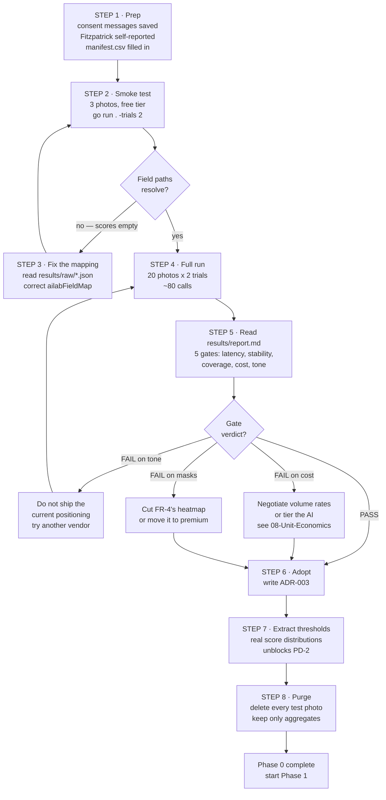

# AI Provider Evaluation
Part of: [[00-Phase-0-Roadmap-MOC|Phase 0 Roadmap]]

> [!warning] The assumption this note exists to audit
> Every artifact in Phase 0 rests on one line in [[04-HLD-and-Architectural-Decisions|HLD]]: *"AI Vision Provider (3rd-party API, MVP)."* No vendor is named, no cost per call is known, and nothing has been tested. Yet [[01-Product-Vision-and-Requirements|FR-4]] promises six per-issue severities with confidence and a tappable heatmap, FR-5 promises a skin age, NFR-2 promises ~8s end-to-end, and NFR-7 makes cost-per-analysis the dominant variable cost. **If that one line is wrong, the domain model, the event contract, the report screen, and the unit economics are all wrong together.** It is the cheapest thing to falsify and the most expensive thing to get wrong.

## What the report contract actually demands

Pulled out of FR-4/FR-5 explicitly, because "AI skin analysis" is not a requirement — this is:

| # | Demand | Source |
|---|---|---|
| D-1 | Six named concerns: acne, redness, dryness, dark spots, texture, pores | FR-4 |
| D-2 | A severity per concern, on the `None → Mild → Moderate → Severe` scale | FR-4, [[02-Domain-Discovery-and-Event-Storming\|Ubiquitous Language]] |
| D-3 | A per-detection confidence (the event payload carries `confidence: 0.86`) | [[05-Project-Structure-and-Contracts\|Event Contracts]] |
| D-4 | A pixel-level mask or polygon, or the "tappable visual heatmap" is not buildable | FR-4 |
| D-5 | A skin-age estimate | FR-5 |
| D-6 | A single 0–100 overall score | FR-4 |
| D-7 | Calibrated for South Asian skin tones — the stated target market | Product Vision |
| D-8 | Stable enough that a trend line means something | FR-8 |

D-7 and D-8 are the ones no vendor advertises, and the only ones that can quietly kill the product.

## Candidate landscape

| Candidate | Covers D-1..D-6? | Access | Notes |
|---|---|---|---|
| **AILab Tools — Skin Analyze Pro** | Appears to cover all six | Self-serve; free tier ~10 calls/mo, from ~$10/mo, credit-based | The only self-serve candidate whose published response covers the six concerns **and** skin age **and** confidence **and** masks. Documented response includes 0–100 scores, `none/mild/moderate/severe` labels, polygon contours for acne/moles/brown spots, base64 heatmaps, ITA skin-tone classification, and a skin-age value. |
| **Perfect Corp (YouCam)** | D-5 missing | Self-serve signup, 40 free units, playground | Market leader. 15+ concerns, 0–100 severity, heatmap/binary mask. Publishes a 95% test-retest reliability claim — directly the D-8 property. **No published skin-age output.** Integration is a 5-step auth + upload + poll flow. |
| **Haut.AI** | Likely, unverified | Enterprise sales, long cycle | 150+ parameters, strong R&D positioning. Enterprise pricing and integration cycle make it wrong for Phase 0 — revisit for the B2B line (FR-13). |
| **Revieve** | Personalization-first | Enterprise | 200+ metrics but positioned as a personalization quiz with a visual layer, not a scanner. Poor fit for FR-4. |
| **General VLM (control arm)** | D-4 impossible | Self-serve | No pixel mask, so it cannot satisfy FR-4's heatmap alone. Included as a **baseline**, not a candidate — see below. |

> [!tip] Why include a general vision model at all
> It answers a question no vendor will: how much of a specialist API's output is real signal versus a confident-looking number? If a general model matches a specialist on stability and agreement, the specialist is not buying much. If it is clearly worse, that is direct evidence the specialists add value — which is the same evidence a B2B buyer (FR-13) will eventually demand from *you*.
>
> Expect this arm to **fail** on D-7. Published evaluations show general-model dermatology accuracy falling sharply as Fitzpatrick type rises — one study found correct-diagnosis rates of 44% on lighter tones versus 12% on darker, declining ~7% per Fitzpatrick step. Measuring that failure is the point: it is the floor the others must clear.

## The finding that changes the risk picture

Good news, stated plainly: **D-1 through D-6 look satisfiable today**, and AILab's published severity enum is `none/mild/moderate/severe` — the exact scale already written into the ubiquitous language. That is a real de-risking of FR-4/FR-5.

> [!warning] What is still unproven, and cannot be settled from documentation
> **D-7 (tone calibration) and D-8 (stability) are the whole risk now.** No vendor publishes per-Fitzpatrick performance. Meanwhile the dataset literature is blunt about why that matters: across 106,950 catalogued lesions in open datasets, only ten images were Fitzpatrick type V and one was type VI; in two datasets carrying ethnicity labels, **zero** images were from South Asian subjects. A vendor trained on that distribution can be simultaneously excellent on its benchmark and wrong for this product's entire target market.
>
> This is not a footnote on the product vision — it *is* the product vision. The PRD's stated wedge is "existing apps are tuned for the wrong skin tones for our target market." If the chosen vendor has the same gap, the app has no wedge, and the differentiator collapses into a re-skin of the competition.

## Confirmed response contract (Skin Analyze Pro)

From the vendor's published **Degree & Score Reference** — no longer inference:

| Concern (FR-4) | Vendor field | Notes |
|---|---|---|
| Acne | `acne_score` | direct |
| Redness | `sensitivity_score` | **proxy** — a vendor composite, not visible redness |
| Dryness | `water_score` | hydration |
| Dark spots | `melanin_score` | see the warning below |
| Texture | `rough_score` | surface roughness |
| Pores | `pores_score` | regional variants also exist (forehead/cheeks/jaw) |

Also present: `blackhead_score`, `wrinkle_score`, `dark_circle_score`, `oily_intensity_score`, `skin_type_score`, `total_score`.

> [!warning] The scale runs the opposite way to intuition
> **Higher means better skin**, and the bands are fixed:
>
> | Band | Meaning |
> |---|---|
> | 90–100 | None |
> | 70–89 | Mild |
> | 50–69 | Moderate |
> | 30–49 | Severe |
>
> The spike had this backwards. Every concern would have been reported inverted — healthy skin as severe, severe skin as healthy — with nothing in the response shape to reveal it. It is fixed and now pinned by tests. Flagging it because the same trap is waiting in `internal/modules/skinanalysis`: **whoever writes the real adapter will assume higher = worse, because everyone does.**
>
> A second consequence: `water_score` high already means *no dryness*, so it needs **no** inversion. The previous "invert moisture" step would now invert twice and be wrong again.

> [!warning] `melanin_score` may be the whole tone-calibration risk in one field
> Dark spots map to melanin, and a **low** score means "Severe". If that field tracks melanin *quantity* rather than uneven *distribution*, deeper skin scores worse by construction — not from any skin concern, but from skin colour.
>
> For an app whose stated market is South Asian women, that is not a bug to tune around; it would mean this vendor cannot serve this product. **If `dark_spots` is the concern that trips the tone gate, suspect this field first.**

> [!tip] `total_score` is not a 0–100 scale
> The documented bands start at 70 — `[70,75]` is already "Poor". So the usable range is roughly **70–100**, while FR-4 promises the user a score "0–100". Showing it raw compresses every user into the top third and makes FR-8's trend look flatter than it is: a 4-point gain reads as noise on a 0–100 axis and as real movement on a 70–100 one.
>
> The spike rescales [70,100] onto [0,100]. That is a **product decision wearing arithmetic's clothes** — it makes low scores look considerably worse than the vendor intends — and it needs a deliberate call before launch, not a default.

## Method

Harness: `D:\ayna-spike` (Go, stdlib + Anthropic SDK). `go run . -demo` runs it on synthetic data with no keys and no cost.

Its `Provider` interface is deliberately the same shape as the `AIAnalysisProvider` port in [[03-DDD-and-Onion-Architecture|DDD & Onion Architecture]]. That is a second, free test: **if a real vendor cannot sit behind that interface, the port is wrong** — much cheaper to learn now than inside `internal/modules/skinanalysis`.

### Gates

Fixed before the data arrives, so a result cannot be rationalised after the fact:

| Gate | Threshold | Traces to |
|---|---|---|
| Latency p95 | < 8s | NFR-2 |
| Stability (same photo, repeated) | ≤ 8 pts | FR-8 (D-8) |
| Coverage | ≥ 5 of 6 concerns | FR-4 (D-1) |
| Cost per scan | ≤ $0.05 | NFR-7 |
| Tone gap between Fitzpatrick bands | ≤ 12 pts | Product Vision (D-7) |

A provider passing everything except the tone gate is recorded **INCOMPLETE**, never PASS. For this product an unmeasured tone gate is unfinished work, not approval.

### Sampling

> [!warning] The sample size is not a detail — it is the experiment
> A trial run on 5 images produced apparent tone gaps of **±20 points from an arm with a known-zero bias**. Per-image variation swamps the effect at that size. **Minimum 10 images per band (I–III, IV–VI)**, balanced for age, sex, and capture conditions — otherwise a genuine difference in the sample reads as vendor bias, and a real bias hides behind a lucky draw. The harness marks undersized rows `UNDERPOWERED` and refuses to conclude from them.

Consent: every face in the test set needs written, retained permission. This sends biometric-adjacent data to third parties, and the standard NFR-4 sets for users applies to the test set too. Do not scrape faces for this.

### What the harness cannot tell you

It measures whether a provider is *consistent, complete, fast, and affordable* — **not whether it is right**. Accuracy needs dermatologist-labelled ground truth. No arm can be called accurate on the strength of this report, including one that passes every gate. Perceived correctness ("yes, that's my skin") is a user-testing question and is arguably the real bar for FR-4.

## Runbook — what happens once you have the photos



### The steps in words

| Step | What you do | Why it matters |
|---|---|---|
| **1 · Prep** | Save consent messages. Label Fitzpatrick by **self-report** (how skin reacts to sun), not by looking at people. Fill `images/manifest.csv`. | Wrong labels make the tone gate meaningless. |
| **2 · Smoke test** | 3 photos on the free tier. | Cheap. Catches a broken field mapping before you spend anything. |
| **3 · Fix mapping** | Open `results/raw/*.json`, compare to `ailabFieldMap`, correct the paths. | Field names were transcribed from docs and are unverified. Expect this loop at least once. |
| **4 · Full run** | 20 photos × 2 trials. ~80 calls. | Only now is the tone gate powered. |
| **5 · Read report** | `results/report.md` — five gates, one verdict per vendor. | Thresholds were fixed beforehand, so the result cannot be argued with after the fact. |
| **6 · Decide** | Adopt, reject, or renegotiate. Write ADR-003. | Unblocks the whole `skinanalysis` module. |
| **7 · Extract thresholds** | Use the real score distributions to set PD-2's severity values, then have them medically reviewed. | This is the *only* honest source for those numbers. |
| **8 · Purge** | Delete every test photo. Keep aggregate scores only. | You promised it in the consent message. NFR-4 applies to the test set too. |

> [!tip] Step 7 is why the spike pays for itself twice
> You are not only choosing a vendor. You are collecting the score distribution that turns PD-2's severity thresholds from guesswork into calibration — the most sensitive logic in the product. That is a second deliverable from the same 80 calls.

## Decision tree

- **An arm passes every gate** → adopt it; draft ADR-003; the Phase 0 model stands unchanged.
- **Passes but fails tone** → do not ship the current positioning. Either find a vendor that clears it, or change the product claim. Shipping a scanner that reads melanin as a defect for the exact audience being courted is the worst available outcome — reputationally and ethically, not just commercially.
- **Passes tone but misses D-4 (masks)** → FR-4's heatmap is not buildable. Cut it or redesign the report screen. Cheap now; expensive after the UI is built around it.
- **Passes but no skin age (D-5)** → either drop FR-5, or compute it yourself — at which point skin age is *your* modelling claim, with the disclosure burden NFR-6 implies. Do not let that decision happen by accident.
- **Cost per scan exceeds the ceiling** → the free tier is not viable as specified. This is a business-model finding, not a technical one, and it lands before any code is written rather than after the first viral spike.

## ADR-003: AI Vision Provider Selection

**Status:** **Accepted, conditionally** — 2026-08-29, amended 2026-08-31.

**R-1 remains OPEN.** `acne_score` moved only seven points between clear skin and
visibly moderate acne (93, rendering as "Clear"), and cropping tighter moved it
to 88 ("Mild"). That points against the vendor — but the test photo carried two
uncontrolled variables, pose and colour temperature, both of which bias the
score toward "Clear". **The finding is suggestive, not settled.** R-2 (skin-tone
calibration) also remains open and moves to production monitoring.

**Context:**

The whole system rests on an assumption nobody had tested: that an affordable
third-party vision API returns six per-issue severities, a confidence, a heatmap,
and a skin age — at usable quality *for the skin tones this product is aimed at*.
Every downstream artifact inherits it: the `SkinReport` aggregate, the event
payloads, the report screen, and the NFR-7 unit economics.

`ayna-spike` measured that against seven gates whose thresholds were fixed
**before any data arrived**, so the result could not be rationalised afterwards.
Two AILab arms were run against four consented faces, twice each, plus the
synthetic control arms.

**The sample is small and that is a deliberate, recorded compromise.** Ayna is a
portfolio project, not a funded product. Photo collection was attempted and
mostly declined — which is itself a finding, recorded under R-2. Six of the seven
gates do not need a large sample: coverage and severity resolution are properties
of the response shape, stability is the same image called twice, and cost is
arithmetic. Only the tone gate needs a designed sample, and it did not get one.

### What was measured

| Gate | Threshold | `ailab-basic` | `ailab-pro` |
|---|---|---|---|
| Latency p95 | < 8s | 1.76s pass | 2.90s pass |
| Stability | ≤ 8 pts | 0 pts pass | 0 pts pass |
| Skin-age drift | ≤ 1 **year** | n/a — no field | **0 yr** pass |
| Coverage | ≥ 5 of 6 | 5/6 pass | **6/6** pass |
| Severity levels | 4 | **2 — FAIL** | **4 (full)** pass |
| Cost / scan | ≤ $0.20 | $0.0405 pass | $0.189 pass\* |
| Tone gap | ≤ 12 pts | not measured | not measured |
| **Verdict** | | **FAIL** | **INCOMPLETE** |

\* At the 110,000-credit tier ($300). See the cost consequence below — at the
entry tier Pro is $0.21 and **fails this gate**.

Pro is INCOMPLETE rather than PASS by the harness's own rule: a provider that
clears everything except tone is never approved outright, because for this
product an unmeasured tone gate is unfinished work rather than absent bad news.

**Decision:**

**Adopt AILab Tools *Skin Analyze Pro* as the paid-tier vision provider.**
Reject *Skin Analyze* (Basic) outright. Keep the free-tier general-model arm
unresolved — `vlm-baseline` was not run, so the tiering decision is not yet
evidenced.

**Why Basic is rejected, and why it is not a close call.** Basic is 4.7× cheaper,
faster, perfectly stable, and covers five of six concerns. None of that matters.
It returns presence flags — `"acne": {"value": 1}` — which say a thing is
*there* but never *how much*. That gives two severity levels where the domain
model needs four. Across four different faces it produced **two distinct overall
scores (60 and 80)**: three of four testers would open the app and see an
identical number. This is structural, not a tuning problem — no future price cut
or model improvement changes the shape of the response, and no mapping can
invent resolution that is not in the data. The most honest reading available
already maps "present" to Moderate, which is a guess standing in for a
measurement.

**What Pro buys.** Full 6/6 coverage, genuine 0–100 scores across four severity
bands, a skin age, and **zero drift on identical pixels** — including on skin
age, the tightest gate in the harness at 1 year rather than 8 points, because
that number sits bare on screen and the UI celebrates a low one.

### Two mapping bugs, both found by reading raw responses

Recorded because the method mattered more than either fix, and because both were
transcribed from vendor documentation that turned out to be wrong.

1. **`redness ← sensitivity_score` was actively wrong, not merely imprecise.**
   Pro returns *both* `sensitivity_score` and `red_spot_score`. On the same real
   face they disagree at opposite ends of the scale: **30 (Severe) versus 90
   (None)**. FR-4 promises *visible redness*; `red_spot_score` names it, while
   sensitivity is a vendor composite about reactivity that merely sounds similar.
   The app would have told a user with clear skin that they had severe redness.
   Now mapped to `red_spot_score` with **no fallback** — a missing field must
   read `unknown`, because silently substituting one that disagrees by 60 points
   is worse than admitting nothing was measured.

2. **Basic's `acne`/`skin_spot` were read from `.rectangle`**, a detection array
   the endpoint never returns. The first run reported two concerns MISSING that
   the vendor had in fact supplied, making coverage look worse than reality.

A third, unrelated: `return_maps=1` failed every Pro call with
`UNSUPPORTED_PARAMETER_VALUES`. The parameter takes named map identifiers, not a
boolean. It is now omitted entirely — no gate needs it, and **FR-4's heatmap
overlay is therefore unevidenced**. Getting the map names right is a question for
whenever that overlay is actually built.

### Open risks

**R-1 — NOT CLOSED. Evidence points against the vendor, but it is confounded.**

> [!warning] This was written up as "closed, against the vendor" on 2026-08-31
> and that was premature. The single test photo had **two uncontrolled
> variables** -- a three-quarter pose showing roughly half the facial skin, and
> warm indoor light with a strong yellow cast. Both bias `acne_score` **upward**
> (toward "Clear"): a turned face halves the visible affected area, and a yellow
> wash compresses the red-channel contrast that acne is detected by. So the
> observed under-reporting may be a property of the photograph rather than of
> the model. One controlled photo settles it; until then this risk is open.

*Resolved 2026-08-31 with one 70-credit call, as planned.* A fifth consented
face was photographed on a phone in ordinary indoor light, with visibly moderate
acne across the cheek and jaw. The thresholds for reading the result were
written down before the call was made.

| Sample | `acne_score` | Renders as |
|---|---|---|
| Four baseline faces (mild acne) | 98–100 | Clear |
| **Moderate, clearly visible acne** | **93** | **Clear** |

The field is not inert — it moved five to seven points — but it stayed inside
the `[90,100]` None band. **A signal that shifts seven points between clear
skin and moderate acne cannot fill a four-level severity scale.** The app would
have told this user *"Breakouts: Clear"*, on an overall score of 33 and a
summary reading *"Looking good"*. Someone who opens Ayna because of their acne
would be told they do not have any. That is the product's worst failure mode,
reached by its most likely user.

### The signal exists; the field is the wrong place to read it

The same response detected the condition through two other fields:

```
red_spot_score   85  -> Mild      picked up the inflammation
rough_score      86  -> Mild      picked up the texture
acne_score       93  -> None      the field named for it did not
```

Both moved by roughly 13 points where acne moved 7, on the same face. So the
vendor's model does see the acne; `acne_score` is simply not where it surfaces.

Also recorded: `water_score` and `melanin_score` both returned **100** on this
face. Perfect scores on two more fields suggest saturation at the top of the
scale is not unique to acne, and that the usable range of several fields is
narrower than the published 0–100 implies.

### Consequences

1. **The report screen must not lead on breakouts** while `acne_score` is the
   source. Shipping it as-is means confidently telling users with acne that
   they have none.
2. **FR-4's six concerns are no longer all sourced.** Acne joins redness (which
   at least has `red_spot_score`) as a promise the current vendor cannot keep
   as specified.
3. **Three options, none free.** Relabel the concern to what the vendor
   actually measures — inflammation and texture rather than "breakouts", which
   is honest but narrows the product's headline claim. Or treat `red_spot_score`
   and `rough_score` as a composite acne proxy, which is inference layered on a
   vendor field and needs saying out loud in the UI. Or re-open the vendor
   decision, which was closed on the assumption that six concerns were covered.
4. **This is a decision for a product owner, not a mapping fix.** It is recorded
   here unresolved on purpose: the honest state is that the vendor selected in
   this ADR cannot deliver one of the six things FR-4 promises.

### A note on method

The prediction table written before the call defined 95–100 as "does not
respond" and 70–89 as "responds weakly", and left **90–94 undefined**. The
result landed in that gap. The conclusion does not turn on it — 93 renders as
Clear either way — but the table should have covered the range, and a
pre-registered threshold with a hole in it is only most of the discipline it
was supposed to be.

**R-2 — the tone gate is unmeasured, and there is now visual evidence against the vendor.**

> [!warning] Added 2026-09-01, from the heatmap overlays.
> Requesting `return_maps` returned a `brown_area` overlay that renders the
> **entire face** in brown on a Fitzpatrick IV subject -- darkest where the
> face is naturally darkest, around the eyes and the shadowed side. The
> `red_area` map on the same photo marks discrete concentrated patches.
>
> That contrast is what the melanin warning in `provider_ailab.go` predicted:
> if the field tracks melanin *quantity* rather than uneven *distribution*,
> deeper skin scores worse by construction. **Overlaying this map would tell a
> brown-skinned user that their whole face is a dark spot.**
>
> One face, and the reading of what the map depicts is inferred rather than
> documented -- so this is evidence, not proof. But it is the first real signal
> on R-2, it cost one call rather than twenty consented photos, and it points
> the wrong way. **Do not ship the `brown_area` overlay, and treat
> `melanin_score` as suspect until the tone comparison is actually powered.**

The sample was one Fitzpatrick III face and three IV. The harness requires ten
*distinct* faces per band and correctly flagged every tone row `UNDERPOWERED`;
the "light" mean is literally one person. The observed gaps (dryness +15.7,
dark spots +5.7) are **noise and must not be quoted** — a zero-bias control arm
produced apparent gaps over 20 points on a comparable sample.

Photo collection was attempted and largely declined. That refusal rate is itself
a product signal: if people who personally trust the developer will not share a
face photo, strangers will hesitate harder, and onboarding's privacy slide is
carrying more weight than the other two combined.

One weak positive: `melanin_score` — the field flagged in advance as the biggest
tone risk — ranged **65 / 85 / 94 across three same-band faces**. If it were
tracking melanin *quantity* rather than uneven distribution, those should have
clustered. That points away from the worst case. It is not evidence of safety.

*Mitigation:* ship with per-band score distributions logged in production —
**aggregates only, never photographs** — under the existing consent flow. Bias
becomes visible within a few hundred scans. Revisit this ADR when it is.

**R-3 — four levels exist; roughly two get used.**

Pro clears the levels gate: the fields genuinely carry 0–100. In practice four of
six concerns clustered tightly (acne 98–100, redness 90–98, texture 85–89, pores
88–97). Only dryness and dark spots moved, and `total_score` produced just two
distinct values across four faces. "The scale supports four levels" is not "the
vendor uses them." n=4 cannot settle this; FR-8's trend line depends on it.

**Consequences:**

- *Positive*: vendor lock-in is confined to `infrastructure/aiprovider/` by
  ADR-002. Replacing AILab means writing one adapter against an existing port,
  not a redesign — which matters more than usual given R-1.
- *Positive*: contract-shaped mapping plus saved raw responses means a mapping
  correction is an edit, not a repurchase. The spike's `-replay` mode rebuilds
  the full report from stored bodies at zero cost, and it paid for itself twice
  during this evaluation.
- *Negative — cost is a cash-flow constraint, not just a per-call one.* AILab
  sells credits, and the rate depends on bundle size:

  | Bundle | $/credit | Pro/call | Verdict vs $0.20 gate |
  |---|---|---|---|
  | 2,000 ($6) | 0.0030 | **$0.2100** | **fails** |
  | 110,000 ($300) | 0.0027 | $0.1890 | passes |
  | 1,000,000 ($2,500) | 0.0025 | $0.1750 | passes |

  Pro clears its own cost gate **only at a $300 up-front commitment**. Paid-tier
  cost at the bulk rate: **$189 / 1k scans, $1,890 / 10k, $18,900 / 100k**. Basic
  cleared the gate at every tier by 4×, which is precisely what makes its
  rejection expensive.
- *Negative*: NFR-5's 99.9% availability is now partly someone else's uptime, and
  there is no fallback provider. The queue absorbs a short outage; a long one is
  visible to users. Not solved here.
- *Negative*: FR-13 (reselling analysis to B2B partners) is **unverified against
  AILab's terms**. A contract question that can invalidate a technically winning
  arm. Check before any B2B commitment.
- *Negative*: FR-4's heatmap overlay is unevidenced — see `return_maps` above.
- *Trigger conditions to revisit*: R-1 resolves against `acne_score`; production
  tone monitoring shows a gap over 12 points; paid volume makes the $300 tier
  worth committing, or makes a self-hosted model cheaper; or FR-13 becomes real
  and the terms forbid it.

**Alternatives considered:**

- *AILab Skin Analyze (Basic)* — **rejected on severity resolution.** Two levels
  cannot fill a four-level domain enum. Measured, not assumed.
- *Perfect Corp* — **not evaluated.** Pricing is quote-only past a 40-call free
  tier, which fails NFR-7's requirement that per-job cost be trackable before a
  vendor is chosen. Reconsider only if AILab fails R-1.
- *A general vision model as the paid provider* — **not evaluated here.** The
  `vlm-baseline` arm exists but was not run. It remains the open question for the
  **free** tier, where the tiering decision assumes a cheap general model is
  adequate. That assumption is still unevidenced.
- *Own model* — rejected for Phase 1. No labelled data, no ground truth, and it
  would convert every output into Ayna's own medical-adjacent claim under NFR-6.

**Cost of reaching this decision:** ~885 of 2,000 credits, **under $3 total**.
## Open questions this feeds

- **Severity thresholds** ([[02-Domain-Discovery-and-Event-Storming|hot spot]], FR-7): can only be calibrated once real score distributions exist. The spike produces exactly that distribution — resolve the threshold decision *after* it, with data, not before it from intuition.
- **NFR-2's 8s budget**: measured vendor latency is the largest term. If p95 inference alone is 6s, the remaining budget for queue, storage, and render is thin — and the progressive "analyzing…" UI stops being polish and becomes load-bearing.
- **Skin age (FR-5)**: may become an owned modelling claim rather than a vendor field. That changes the compliance surface under NFR-6.

## Sources

- [Haut.AI — AI Skin Analysis](https://haut.ai/product/ai-skin-analysis)
- [Perfect Corp — Skin Analysis API](https://yce.perfectcorp.com/ai-api/products/skin-analysis-api)
- [AILab Tools — Skin Analyze Pro API docs](https://www.ailabtools.com/doc/ai-portrait/analysis/skin-analysis-pro/api-v162)
- [AILab Tools — pricing](https://www.ailabtools.com/price)
- [Exploring the Diagnostic Capability of AI in Dermatology for Darker Skin Tones (NCBI)](https://www.ncbi.nlm.nih.gov/pmc/articles/PMC12624499/)
- [Assessing GPT-4's Diagnostic Accuracy with Darker Skin Tones (medRxiv)](https://www.medrxiv.org/content/10.1101/2024.04.17.24305928.full.pdf)
- [Skin of Color Underrepresented in AI Skin Cancer Datasets (Medscape)](https://www.medscape.com/viewarticle/962629)

## Related
[[05-Project-Structure-and-Contracts|← Project Structure & Contracts]] · [[07-Product-Decisions|Next: Product Decisions →]] · [[00-Phase-0-Roadmap-MOC|Back to Roadmap]]
